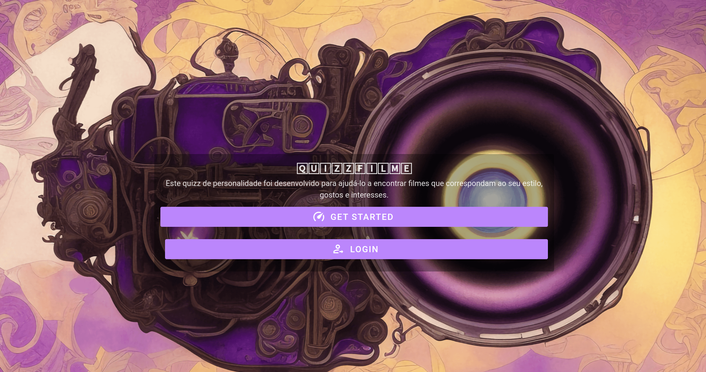

# QuizzFilme
Esse projeto é site-web onde o usuário faz um quizz para determinar sua personalidade e baseado nessa personalidade um filme é recomendado.
## Porque fazer esse projeto?
Esse projeto foi feito para testar meus conhecimentos da criação de um sistema full-stack, com docker e Api Mock.

## Linkzinho pro vídeo
[quizzfilme apresentação](https://drive.google.com/file/d/1Pypl0HYsp6Awa55C52c3O_vmKoMQq27_/view?usp=share_link)

## O que eu usei para fazer esse projeto?
- Template Djavue feito pelo @huogerac.
- django
- Vue
- Postgres
- Docker
- Pytest



## Requisitos
- Docker & Docker compose instalados para subir tudo muito rápido e não precisar instalar/configurar infinitas libs/ferramentas diretamente na sua máquina

## Como rodar localmente o projeto:
```bash
$ cd quizzfilme
$ docker-compose build
$ docker-compose up -d backend frontend
```

Depois de fazer o build e iniciar todos containers, fazendo um `docker ps` é possível ver que temos os seguintes serviços rodando:

```
$ docker ps
CONTAINER ID   IMAGE                  COMMAND                 NAMES
a72fb2ab3ba2   back-todoten           "wait-for-it localho…"  mytodolist_backend_1
6ef83aab15e5   front-todoten          "docker-entrypoint.s…"  mytodolist_frontend_1
6def45b54094   nginx                  "/docker-entrypoint.…"  mytodolist_nginx_1
93e76c660729   postgres:13.3-alpine   "docker-entrypoint.s…"  mytodolist_postgres_1
```
🚀 Para acessar os serviços, utilize as URLs abaixo:
- `http://localhost` para acessar o frontend
- `http://localhost/api` para acessar diretamente alguma rota da API
- `http://localhost/admin` para acessar o Django admin

### Para rodar com mock:

```bash
$ docker-compose -f docker-compose.yml -f docker-compose.apimock.yml up frontend
```


